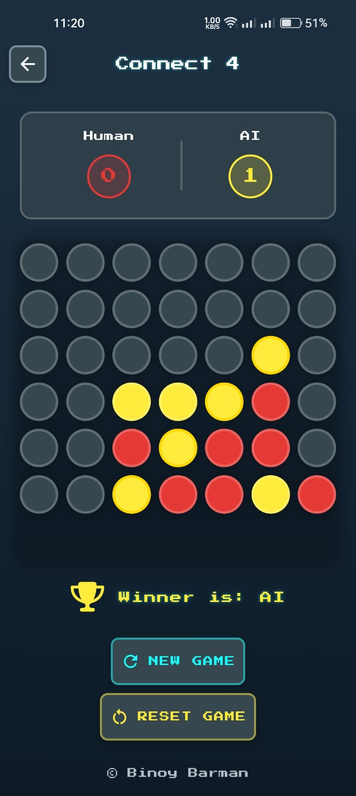

# 🧠 AI-Powered Connect 4 Game 🎮

Welcome to the classic **Connect 4** – reimagined with strategic AI and a vibrant Flutter UI!  
Play solo against a smart bot in this timeless grid-based battle.

---

## 🧩 Features

- 🧱 **Board Setup**
  - 7x6 grid, just like the original game  
  - Gravity-based drop logic for realistic gameplay

- 👥 **Game Mode**
  - **Player vs AI Mode** – Compete against an intelligent AI

- 🤖 **AI Intelligence**
  - Built using the **Minimax Algorithm**
  - Enhanced with **Alpha-Beta Pruning** for efficiency
  - AI evaluates only valid drop positions per column
  - Depth-limited for optimal performance

- 🎨 **UI Highlights**
  - Retro-style font with `PressStart2P`
  - Bold colors and smooth grid layout
  - Winning tiles are highlighted for clarity
  - Designed for dark backgrounds with glowing effects

---

## 🚀 Getting Started

1. **Clone the repo**
   ```bash
   git clone https://github.com/your-username/connect4-ai.git
   cd connect4-ai

2. Install dependencies

    ```bash
    flutter pub get
    ```

3. Run the app

    ```bash
    flutter run
    ```

---

## ⚙️ Tech Stack

- **Flutter (Dart)**
- **Minimax Algorithm** with pruning
- **Custom Game Logic** for Connect 4 mechanics
- **Google Fonts** & Clean UI

---

## 📸 Screenshots

<p align="center">
  
  
</p>

---

## 🙋‍♂️ About the Developer

Developed by **Binoy Bhushan Barman Dipu**, a dedicated Flutter developer with a strong passion for building intelligent, algorithm-driven applications.

Let's connect on [LinkedIn](https://www.linkedin.com/in/binoydipu)!
